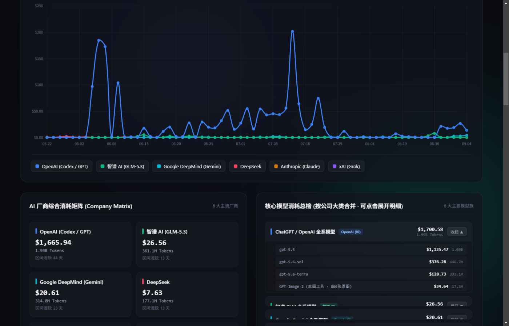
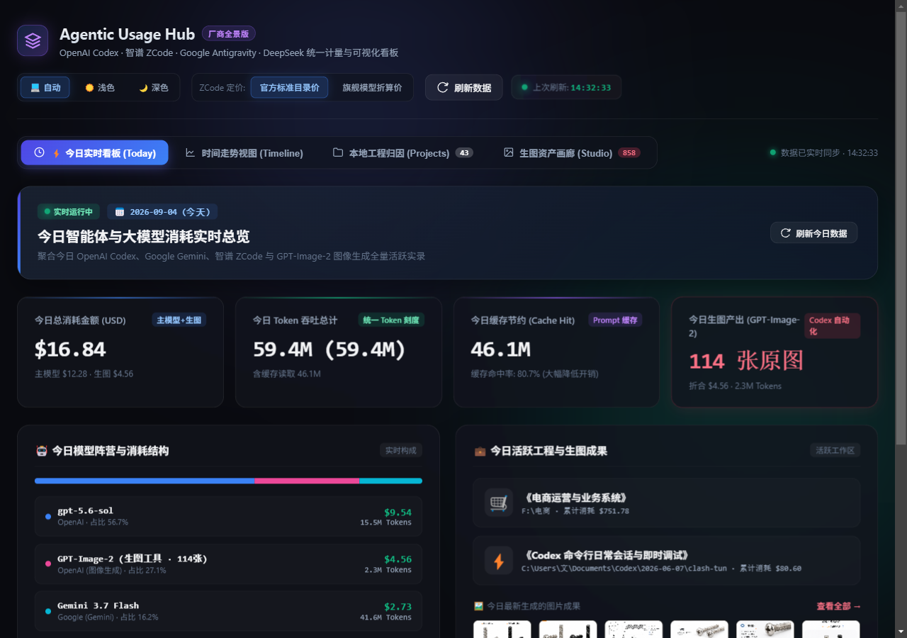
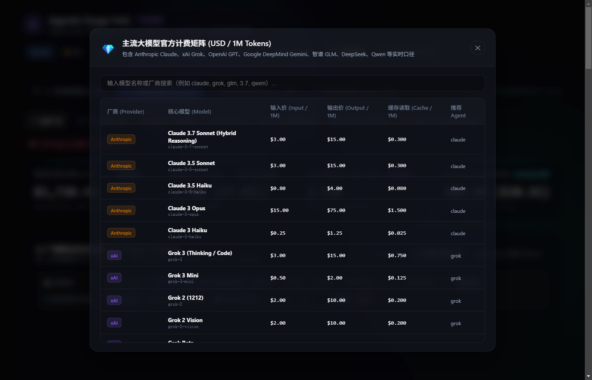

# Agentic Usage Hub — 多智能体统一计量与可视化看板

<p align="center">
  <b>面向 OpenAI Codex · Anthropic Claude · xAI Grok · 智谱 ZCode · Google Antigravity · DeepSeek 全生态 AI 编程智能体的统一 Token 计量、成本折算与本地工程归因看板</b>
</p>

<p align="center">
  <a href="README.md"><b>简体中文</b></a> | <a href="README_EN.md"><b>English</b></a>
</p>

<p align="center">
  <a href="https://github.com/wangx1ao2/agentic-usage-hub/actions/workflows/ci.yml">
    
  </a>
  <a href="https://nodejs.org"></a>
  <a href="https://www.npmjs.com/package/agentic-usage-hub"></a>
  <a href="LICENSE"></a>
</p>

---

## 📸 界面预览 (Screenshots)

<p align="center">
  <b>全景时间走势看板 (Timeline Dashboard)</b><br>
  <i>支持按厂商、按模型双维度多维下钻，支持对数标尺与自定义区间分析</i><br>
  
</p>

<p align="center">
  <b>今日实时消耗与 Agent 构成 (Today Live)</b><br>
  <i>跨厂商聚合今日大模型活跃吞吐、Prompt 缓存复用率与生图资产构成</i><br>
  
</p>

<p align="center">
  <b>官方计费速查矩阵抽屉 (Pricing Matrix Drawer)</b><br>
  <i>内置 6 大主流 AI 厂商、数十款前沿模型（含 Claude Fable 5、Grok 4.6、GPT-5.6 等）官方费率与模糊检索</i><br>
  
</p>

---

## 🌟 项目简介

在现代 AI 辅助研发工作中，开发者通常组合使用多种 Agent 编程助手（如 OpenAI Codex CLI、Claude Code、xAI Grok CLI、智谱 AI ZCode、Google Antigravity/Gemini、DeepSeek OpenClaw/Reasonix 以及 Codex 原生生图工具）。由于各工具的计费机制、缓存策略、日志存放路径及数据格式高度异构，传统工具往往难以提供全生命周期的统一视图。

**Agentic Usage Hub** 是一套轻量、高性能、零第三方重框架依赖的本地全景监控面板：
- **全面覆盖主流大模型计费**：内置针对 **Anthropic Claude**（Claude Fable 5 智能体、Claude 4.5 系列、3.7 Sonnet 混合推理、3.5 Sonnet/Haiku、Opus）、**xAI Grok**（Grok 4.6 多模态/深度思考、Grok 4、Grok 3、Grok 2）、**OpenAI**（GPT-5.6 系列、o3-mini、o1 系列、GPT-4o 系列）、**Google DeepMind**（Gemini 3.7 Flash、2.5 Pro/Flash）、**DeepSeek**（V4 Pro/Flash、R1 Reasoner、V3 Chat）、**智谱 AI**（GLM-5.3 旗舰版/Flash、GLM-5.2）以及阿里通义千问 Qwen 等的官方最新目录计费与 Prompt 缓存读取单价折算；
- **今日实时看板 (Today Live)**：跨厂商聚合今日大模型活跃吞吐与生图工具（`GPT-Image-2`）的实时构成；
- **全景时间走势图 (Timeline & Chart.js)**：支持「🏢 按厂商大类」与「🧬 按核心模型」双维度自由切换，提供对数刻度、自定义 Y 轴缩放、区间预设与明细表格检索；
- **本地工程归因 (Projects Attribution)**：自动提取各 Agent 会话所绑定的本地物理工作区与工程目录，按业务主题聚类归因（商业化、小说、电商、技术博客等）；
- **生图资产 Studio 画廊**：增量检索 Codex 自动化生成的图片资产与 Prompt，支持灯箱大图预览；
- **官方计费速查矩阵**：前端内置交互式主流大模型官方计费价目矩阵抽屉，支持按模型名/厂商即时模糊搜索与实时费率核对；
- **双主题自适应**：支持跟随系统（`prefers-color-scheme`）自适应切换，并提供一键手动控制（自动 / 浅色 / 深色）。

---

## ❓ 常见问题 (FAQ)

- **为什么要统计 AI 编程智能体的 Token 用量？** —— 订阅与 API Key 分散在各家，Token 烧了多少在账单来之前完全不可见。统一视图能把"AI 花费"变成可度量的工程指标。
- **如何查看我的 Claude Code / Codex CLI 会话实际花了多少钱？** —— 运行 `npx agentic-usage-hub`，它会以只读方式解析各 Agent 本地会话日志，按内置官方价目表（含 Prompt 缓存读取单价）折算成美元，实时展示按模型、按厂商的成本。
- **支持哪些 AI 编程智能体？** —— OpenAI Codex CLI（含 GPT-Image-2 生图资产）、Anthropic Claude Code、xAI Grok CLI、Google Antigravity / Gemini、DeepSeek OpenClaw / Reasonix、智谱 AI ZCode；适配器接口清晰，新增 Agent 成本很低。
- **与 ccusage 有什么区别？** —— ccusage 在终端分析 Claude Code 单一工具的用量；Agentic Usage Hub 把**所有**主流编程 Agent 聚合进同一个本地看板，并提供跨厂商实时遥测、按工程归因与交互式价目矩阵。
- **我的数据会离开本机吗？** —— 不会。看板 100% 本地离线运行：无遥测上报、无账号、无需任何 API Key，只读取你已有的 Agent 日志。
- **如何把 Token 消耗归因到具体项目？** —— 每个 Agent 会话都携带工作目录信息，归因引擎会将其聚类到你的物理工程与工作区，并按项目汇总 Token 与成本。

---

## 🏗️ 架构与目录结构

```text
agentic-usage-hub/
├── .github/workflows/ci.yml # GitHub Actions 持续集成自动化测试工作流
├── bin/                     # CLI 全局运行入口 (npx agentic-usage-hub)
│   └── agentic-usage-hub.js
├── docs/                    # 项目文档与高清预览资源
│   └── images/              # 界面效果图
├── unified-server.js        # 核心 Node.js 原生 HTTP 服务与路由调度
├── models-pricing.js        # 统一模型定价矩阵、Fuzzy 模糊规整与厂商识别引擎
├── antigravity-adapter.js   # Google Antigravity / Gemini 3.7 Flash 本地日志解析适配器
├── codex-image-adapter.js   # Codex GPT-Image-2 生图资产增量索引与 Prompt 提取
├── openclaw-adapter.js      # DeepSeek / Claude / Grok (OpenClaw / Reasonix) 历史轨迹调用解析
├── project-adapter.js       # 本地物理工程与工作区智能聚类归因
├── zcode-adapter.js         # 智谱 AI (Z.ai) SQLite 数据库直读与双计费定价计算
├── .env.example             # 环境变量配置模板
├── .gitignore               # Git 忽略规则 (node_modules, 敏感文件, 缓存)
├── package.json             # 项目元数据与 npm 脚本 (start, test, daily, monthly)
├── public/                  # 静态前端 SPA 应用
│   ├── index.html           # 前端 SPA 骨架与面板容器
│   ├── app.js               # 前端状态流转、API 请求、图表交互与渲染逻辑
│   ├── styles.css           # 双主题 Design Tokens、Glassmorphism 布局与响应式样式
│   └── chart.umd.js         # 本地化 Chart.js 库
└── tests/                   # 自动化集成与单元测试套件
    ├── api.test.js          # REST API 端点、边界条件、错误处理与安全防御测试
    └── adapters.test.js     # 各厂商适配器解析、计费公式与数据结构测试
```

---

## 🚀 快速启动

### 方式一：npx 免安装直接运行（推荐 ⚡）

无需手动克隆代码仓库，只要电脑中安装了 Node.js (v20+)，在终端中直接运行：

```bash
# 启动看板 (默认端口 4242)
npx agentic-usage-hub

# 或指定端口并在启动后自动在浏览器打开页面
npx agentic-usage-hub -p 4242 -o
```

启动完成后，直接在浏览器中访问：👉 **`http://localhost:4242`**

### 方式二：Git 源码安装

```bash
# 1. 克隆代码仓库
git clone https://github.com/wangx1ao2/agentic-usage-hub.git
cd agentic-usage-hub

# 2. 安装基础依赖
npm install

# 3. 启动统一看板服务 (默认监听 4242 端口)
npm start
```

### 命令行参数 (CLI Flags)

| 参数 | 缩写 | 默认值 | 作用说明 |
| :--- | :--- | :--- | :--- |
| `--port <port>` | `-p` | `4242` 或 `$PORT` | 自定义 HTTP 监听端口 |
| `--open` | `-o` | `false` | 服务就绪后自动调用系统默认浏览器打开大屏 |
| `--version` | `-v` | - | 打印当前安装版本号 |
| `--help` | `-h` | - | 输出帮助指南与支持的模型列表 |

### 环境变量配置（可选）
项目开箱即用，无需配置即可自动读取用户目录下的默认 Agent 日志。如需自定义端口或日志路径：
```bash
cp .env.example .env
```
支持配置项：
- `PORT`: HTTP 监听端口（默认 `4242`）
- `CODEX_IMAGE_DIRS`: 自定义 Codex 生图目录路径（可选）
- `OPENCLAW_SESSIONS_DIR`: 自定义 OpenClaw 会话目录（可选）
- `REASONIX_USAGE_FILE`: 自定义 Reasonix 计量日志路径（可选）

### 运行自动化测试套件
本项目包含覆盖核心 API、适配器计算、参数校验和路径安全防御的完整测试（共 25 项测试用例，100% 通过）：
```bash
npm test
```

---

## 📡 API 端点规范

| 路径 | 方法 | 说明 | 关键参数 |
| :--- | :--- | :--- | :--- |
| `/api/dashboard` | `GET` | 获取看板全量聚合数据 | `tier`: `standard` \| `flagship`<br>`agent`: `all` \| `codex` \| `claude` \| `grok` \| `zcode` \| `antigravity` \| `openclaw` |
| `/api/models-pricing` | `GET` | 获取系统内置的全量模型官方价目矩阵与厂商色彩配置 | 无 |
| `/api/projects` | `GET` | 获取归因分析后的本地工程列表 | 无 |
| `/api/refresh` | `GET` | 强制穿透刷新并清除服务端缓存 | 无 |
| `/api/codex-image` | `GET` | 安全读取 Codex 本地生成的图片 | `path`: 本地图片绝对路径（已做安全目录与扩展名强校验） |

---

## 🛡️ 安全与健壮性设计

1. **零外部网络泄露与无凭证依赖**：
   - 本看板为纯本地运行的遥测聚合器，不依赖任何第三方线上上报服务器，绝不向外网发送任何代码或会话敏感信息；
   - 无需在看板中配置任何 API Key 或密码即可启动。
2. **路径遍历防御 (Path Traversal Protection)**：
   - `/api/codex-image` 仅允许读取合法生图目录下的图片文件，严禁通过 `../` 越界访问；
   - 静态资源服务器强制限制在 `public/` 目录范围内，越界请求直接返回 `403 Forbidden`。
3. **全局错误边界与兜底**：
   - 服务端所有路由封装统一的 `try...catch`，避免任何单点异常使服务挂起；
   - 前端集成断网/服务异常全局提示条与“点击重试”机制；
   - 图像资源加载失败时自动应用轻量 SVG 占位图兜底。
4. **多级高性能缓存**：
   - 磁盘级增量时间戳比对缓存（避免重复全量读取数 GB 日志）；
   - 服务端 10s 内存响应缓存（削峰填谷，降低高频请求压力）。

---

## 🔍 已知范围与使用说明 (Scope & Limitations)

- **只读分析**：本工具为只读遥测分析看板，不会修改您的任何 Agent 原始会话日志、SQLite 数据库或工程源代码；
- **环境依赖**：各 Agent 历史数据的丰富程度取决于您本机已使用的编程助手（如未在本地运行过 Claude Code 或 Grok CLI，对应厂商的数据将显示为待使用状态，一旦运行将自动被检索聚合）。

---

## 📄 许可说明
本项目基于 [MIT License](LICENSE) 开源。

<a href="llms.txt">🤖 llms.txt — 面向 LLM / AI 爬虫的机器可读项目摘要</a>
